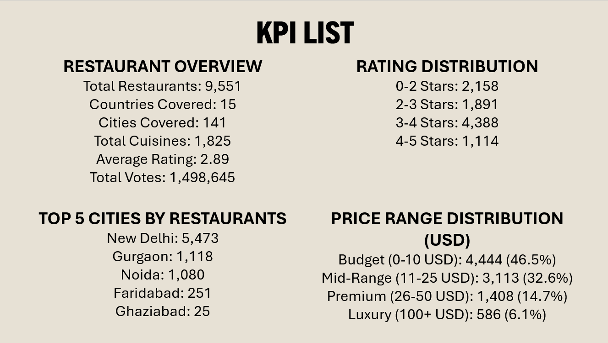
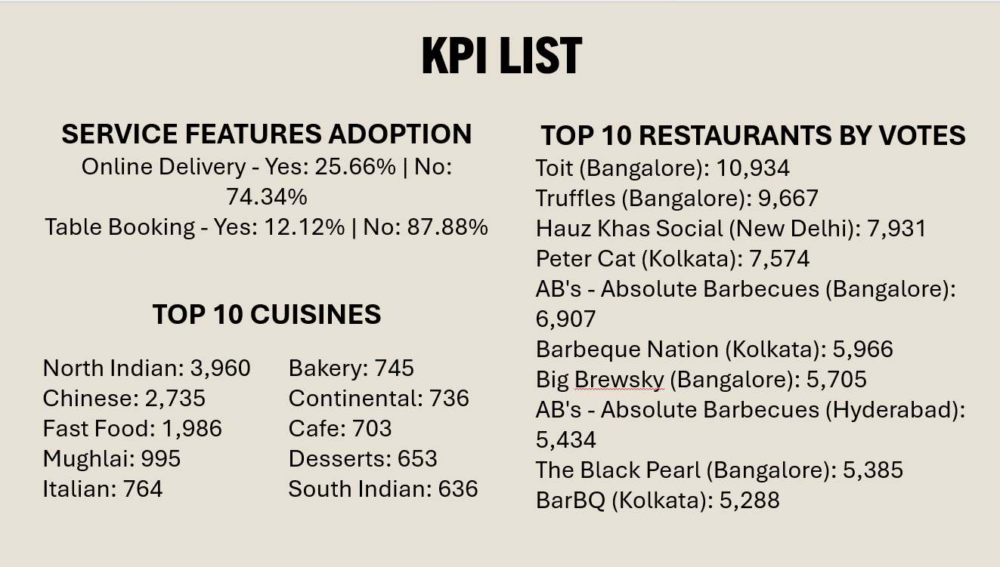
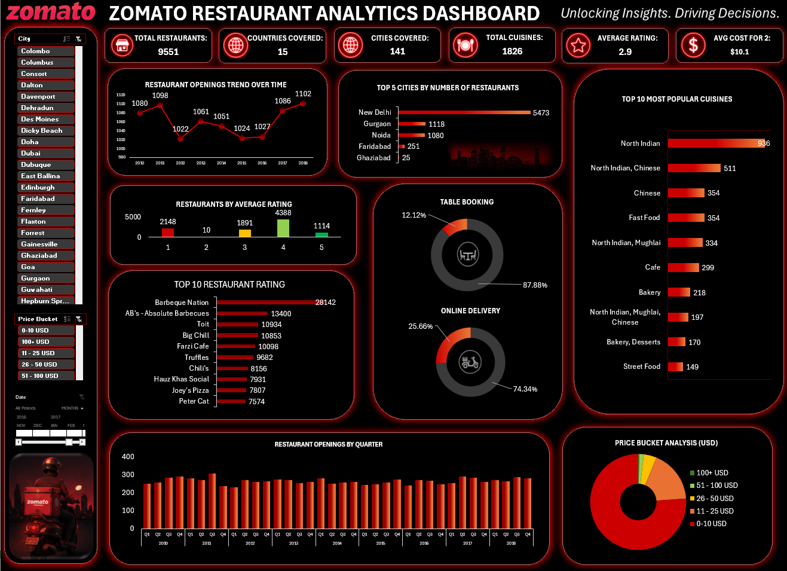
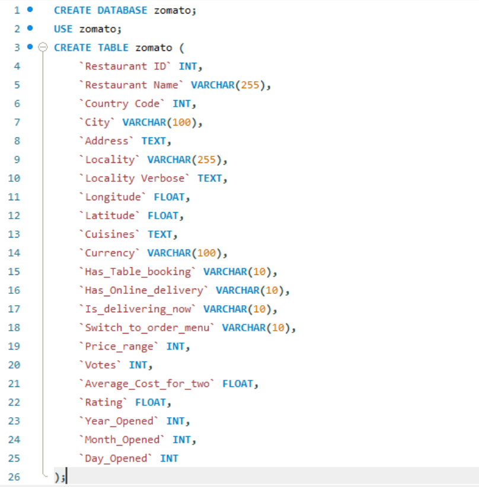
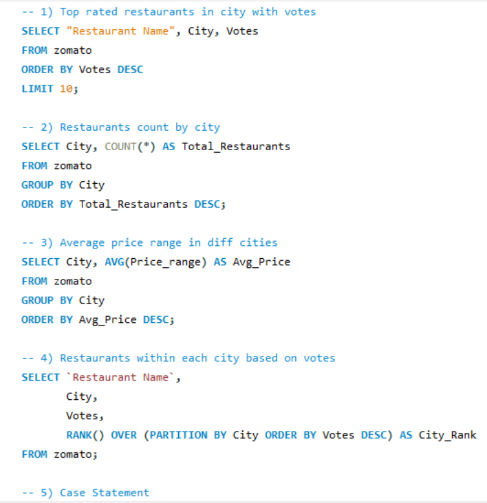
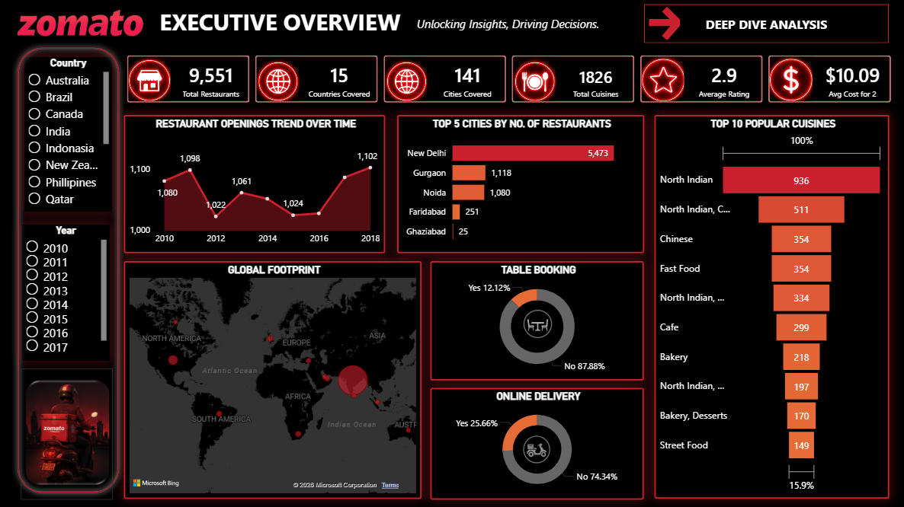
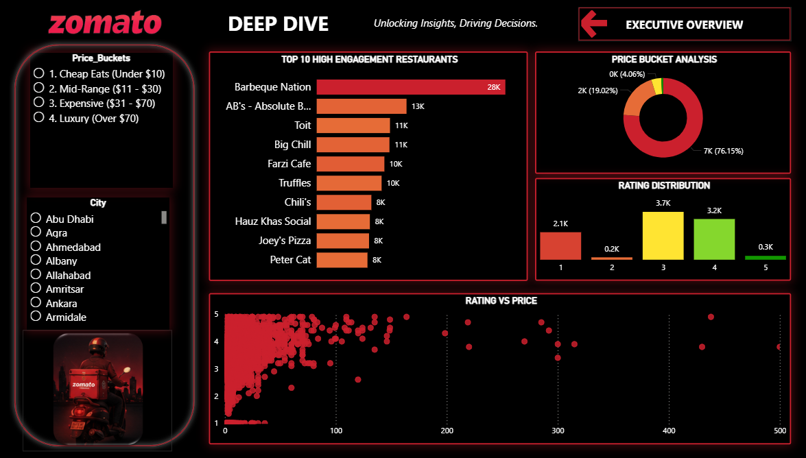
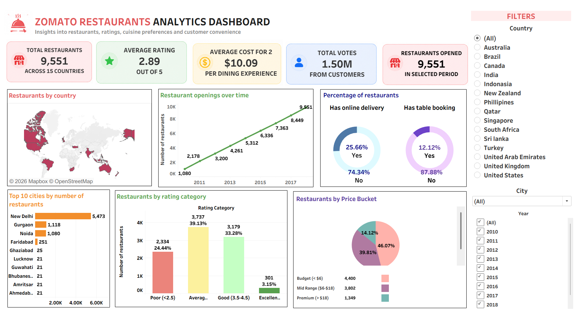
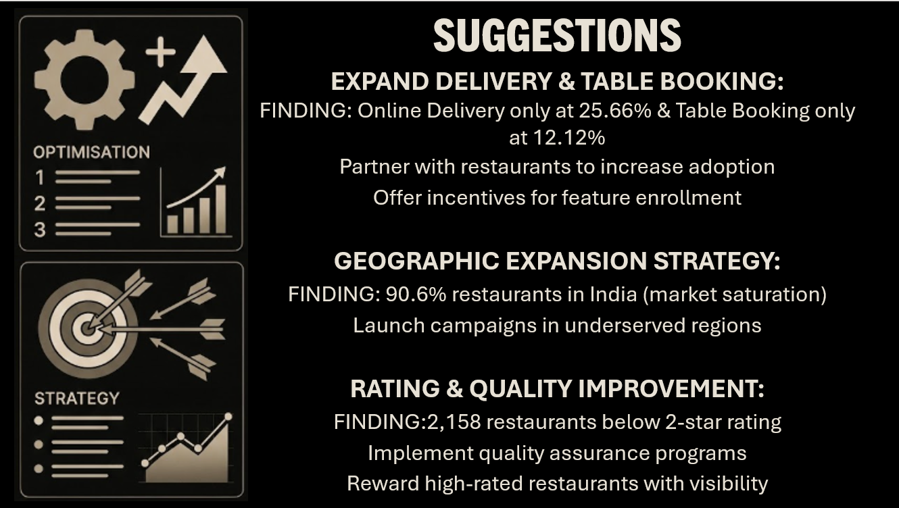
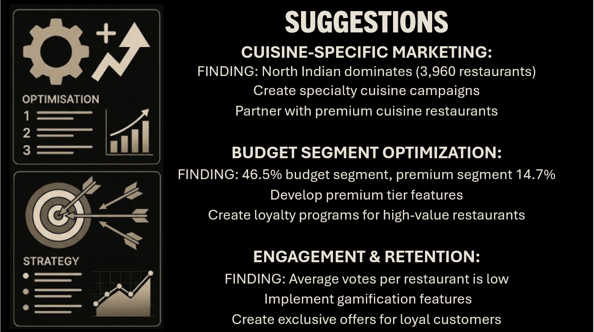

# Zomato Global Restaurant Analytics

This project presents a comprehensive, end-to-end analysis of the Zomato restaurant dataset using **four industry-standard tools** - **Advanced Excel, MySQL, Power BI, and Tableau**. Each tool tackles the same dataset from a different angle: from raw SQL querying and relational data modeling, to interactive dashboards and visual storytelling. The goal is to uncover actionable insights on restaurant distribution, cuisine trends, pricing, ratings, and online service adoption across 15 countries and 9,551 restaurants.

---

## KPI List

The following KPIs were tracked consistently across all four tools:




---

## 1. Advanced Excel



### Project Overview
This project is an end-to-end data analysis and visualization of Zomato restaurant data using Microsoft Excel. The goal is to uncover actionable insights regarding restaurant geographical distribution, customer ratings, average pricing, cuisine popularity, and service availability (like table booking and online delivery).

By structuring raw data into a robust data model and leveraging Pivot Tables, this interactive dashboard provides a bird's-eye view of Zomato's global footprint and local market dynamics.

### Key Performance Indicators (KPIs)
- **Total Restaurants:** 9,551
- **Global Reach:** 15 Countries & 141 Cities
- **Culinary Variety:** 1,826 Distinct Cuisines
- **Average Customer Rating:** 2.89 / 5.0
- **Average Cost for Two (USD):** $10.09

### Key Insights & Findings

**Geographical Distribution**
- **Dominant Market:** India holds the vast majority of restaurants in the dataset (New Delhi alone accounts for over 5,400 restaurants).
- **Top Cities:** The top 5 cities by restaurant count are heavily concentrated in the NCR region (New Delhi, Gurgaon, Noida, Faridabad, Ghaziabad).

**Service Availability**
- **Online Delivery:** Only ~25.6% of restaurants offer online delivery services.
- **Table Booking:** A mere ~12.1% of listed restaurants provide table booking options.

**Pricing & Affordability**
- The platform is predominantly populated by budget-friendly options — 7,273 restaurants fall in the $0–$10 USD range and 1,680 in the $11–$25 USD range.
- Only 37 restaurants fall into the high-end $100+ USD category.

**Ratings & Customer Preferences**
- Most restaurants receive either a 3-star (1,891) or 4-star (4,388) rating, with a significant portion (2,148) unrated or 1-star.
- **Top Cuisines:** North Indian, Chinese, Fast Food, and Café options dominate by volume.
- **Most Engaged:** Barbeque Nation, AB's - Absolute Barbecues, and Toit lead in total user votes.

**Growth Trends**
- Restaurant onboarding showed consistent yearly volume from 2010 to 2018, with peak additions around 1,000–1,100 new listings per year.

### Tools & Techniques Used
- **Microsoft Excel** — Primary tool for data cleaning, modeling, and visualization.
- **Data Modeling** — Connected multiple fact and dimension tables (`Main`, `Country`, `Currency`, `Calendar`) using primary and foreign keys.
- **Data Transformation** — Standardized global currencies to USD for accurate average cost comparisons.
- **Pivot Tables & Pivot Charts** — Aggregated data into visual KPIs (pie charts for delivery/booking percentages, bar charts for price buckets).
- **Time Intelligence** — Extracted Year, Quarter, and Month data to track restaurant opening trends over time.

### Dataset Structure
1. **Fact Table:** `MAIN` — Core restaurant details, coordinates, ratings, and votes.
2. **Dimension Tables:**
   - `COUNTRY` — Maps Country Codes to Names
   - `CURRENCY` — Contains conversion rates to USD
   - `CALENDAR` — Date hierarchy for time-series analysis

---

## 2. MySQL




### Project Overview
This section covers the SQL-based analysis of the Zomato dataset using MySQL. Structured queries were used to extract, aggregate, and analyze restaurant data to answer key business questions directly from the raw data.

### Queries

```sql
CREATE DATABASE zomato_analysis;
USE zomato_analysis;

SELECT * FROM main1;
SELECT * FROM country;
SELECT * FROM currency;

-- Top rated restaurants
SELECT `RestaurantName`, City, Votes
FROM main1
ORDER BY Votes DESC
LIMIT 10;

-- Restaurant count by city
SELECT City, COUNT(*) AS Total_Restaurants
FROM main1
GROUP BY City
ORDER BY Total_Restaurants DESC;

-- Average price range by city
SELECT City, AVG(Price_range) AS Avg_Price
FROM main1
GROUP BY City
ORDER BY Avg_Price DESC;

-- Restaurants with online delivery
SELECT `RestaurantName`, City
FROM main1
WHERE Has_Online_delivery = 'Yes';

-- Ranking restaurants based on votes
SELECT `RestaurantName`,
       City,
       Votes,
       RANK() OVER (ORDER BY Votes DESC) AS Ranking
FROM main1;
```

---

## 3. Power BI




### Project Overview
A high-performance, dark-themed Power BI dashboard analyzing global restaurant data from Zomato. This project focuses on end-to-end data engineering — from ETL and currency normalization to advanced time intelligence and interactive storytelling.

### Key Features
- **Currency Normalization:** Automated conversion of local restaurant costs (15+ currencies) into a unified USD Metric for global benchmarking.
- **Two-Page Interactive Navigation:** User-friendly interface utilizing Button Navigation to toggle between high-level KPIs and granular data.
- **Advanced Time Intelligence:** Custom Calendar table supporting standard and Financial Year (April–March) reporting.
- **Aesthetic UI:** Dark-mode design with Zomato-brand accent coloring (#CB202D) and glowing area charts.
- **Price Segmentation:** Dynamic grouping of restaurants into Price Buckets (Cheap Eats, Mid-Range, Expensive, Luxury).

### Data Engineering & ETL (Power Query)
1. **Data Loading:** Imported three core datasets: `Main`, `Country`, and `Currency`.
2. **Date Reconstruction:** Combined separate Year, Month, and Day columns using custom M-code: `#date([Year Opening], [Month Opening], [Day Opening])`
3. **Relational Merging:** Left Outer Join between `Main` and `Currency` tables to pull in exchange rates.
4. **Calculated Columns:** Created `Cost in USD` by multiplying `Average_Cost_for_two` with the `USD Rate`.
5. **Clean-up:** Removed null values from dimensional tables and standardized data types.

### Data Modeling
- **Schema:** Star Schema
- **Primary Table:** `Main` (Fact table)
- **Dimensions:** `Country` (via `CountryCode`), `Calendar` (via `OpeningDate`)
- **Cardinality:** Strict Many-to-One (*:1) with single cross-filter direction

### Advanced DAX Measures

**Core Metrics:**
```dax
Total Restaurants = DISTINCTCOUNT('Main'[RestaurantID])
Average Rating = AVERAGE('Main'[Rating])
Countries Covered = DISTINCTCOUNT('Country'[Countryname])
```

**Engagement Analysis:**
```dax
Table Booking Count = CALCULATE([Total Restaurants], 'Main'[Has_Table_booking] = "Yes")
% Table Booking = DIVIDE([Table Booking Count], [Total Restaurants], 0)
```

**Custom Grouping:**
```dax
Price_Buckets = SWITCH(TRUE(),
    [Cost in USD] <= 10, "Cheap Eats",
    [Cost in USD] <= 30, "Mid-Range",
    [Cost in USD] <= 60, "Expensive",
    "Luxury"
)
```

### Dashboard Breakdown

**Page 1: Executive Overview**
- 6 KPI cards highlighting global reach (Cuisines, Cities, Countries, Costs)
- Dark-style world map showing restaurant density by country
- Area chart with neon glow effect for restaurant openings over time
- TreeMap identifying top 10 most popular cuisines

**Page 2: Deep Dive Analysis**
- Price Bucket breakdown across cost segments
- Column chart for rating distribution
- Top 10 Restaurants by total user votes (horizontal bar chart)
- Dynamic slicers for Country, Year, and Price Bucket

---

## 4. Tableau



### Live Dashboard
🔗 **[View Interactive Dashboard on Tableau Public](https://public.tableau.com/app/profile/angelvbenit/viz/zomato-dashboard/zomato-dashboard)**

### Project Overview
An interactive Tableau dashboard analyzing 9,551 restaurants across 15 countries. This project explores restaurant distribution, cuisine preferences, pricing, ratings, and online service adoption across the globe — built entirely in Tableau Desktop.

### Dataset
| Sheet | Description |
|---|---|
| `Main` | 9,551 restaurant records — core fact table |
| `Country` | Country ID to Country Name mapping (15 countries) |
| `Currency` | Local currency to USD conversion rates |
| `Date` | Calendar reference table |

### Key KPIs & Insights
| Metric | Value |
|---|---|
| Total Restaurants | 9,551 |
| Countries Covered | 15 |
| Average Rating | 2.89 / 5 |
| Average Cost for 2 | $10.09 USD |
| Total Customer Votes | 1.50M |
| Restaurants with Online Delivery | 25.66% |
| Restaurants with Table Booking | 12.12% |

**Notable Findings:**
- North Indian cuisine dominates with 3,253 restaurants
- New Delhi leads all cities with 5,473 restaurants
- 46.07% of restaurants fall in the Budget (< $6) price tier
- Restaurant openings have grown steadily since 2010
- Only 12.12% of restaurants offer table booking — a significant market gap

### Dashboard Features
- **World Map** — Restaurant density by country (color-coded)
- **Openings Over Time** — Year-by-year growth line chart
- **Donut Charts** — Online delivery & table booking percentages
- **Top 10 Cities** — Horizontal bar chart ranked by restaurant count
- **Rating Categories** — Poor / Average / Good / Excellent breakdown
- **Price Buckets (USD)** — Budget / Mid Range / Premium distribution
- **Interactive Filters** — Country, City, Cuisine, Rating, Price Bucket

### Calculated Fields

```
-- Combine split date columns into a proper date
Date Opening = MAKEDATE([Year Opening], [Month Opening], [Day Opening])

-- Convert local currency to USD
Cost for 2 (USD) = [Average_Cost_for_two] * [USD Rate]

-- Clean invalid ratings
Rating (Clean) = IF [Rating] < 1 THEN NULL ELSE [Rating] END

-- Categorise ratings
Rating Category:
  IF ISNULL([Rating (Clean)]) THEN "Not Rated"
  ELSEIF [Rating (Clean)] < 2.5 THEN "Poor (<2.5)"
  ELSEIF [Rating (Clean)] < 3.5 THEN "Average (2.5-3.5)"
  ELSEIF [Rating (Clean)] < 4.5 THEN "Good (3.5-4.5)"
  ELSE "Excellent (>4.5)"
  END

-- USD price buckets
Price Bucket (USD):
  IF [Cost for 2 (USD)] < 6 THEN "Budget (< $6)"
  ELSEIF [Cost for 2 (USD)] < 18 THEN "Mid Range ($6-$18)"
  ELSE "Premium (> $18)"
  END
```

### Notes
- All monetary values are displayed in USD using live conversion rates from the dataset
- Coordinates of (0, 0) are treated as null to avoid false map pins
- The Total Restaurants KPI is fixed at 9,551 and intentionally excluded from filters as a baseline reference




---

**Developed by:** Angel Benit Veronica  
**Objective:** Created as a portfolio project to demonstrate expertise in Advanced Excel, MySQL, Power BI, DAX, Tableau, and Data Storytelling.
